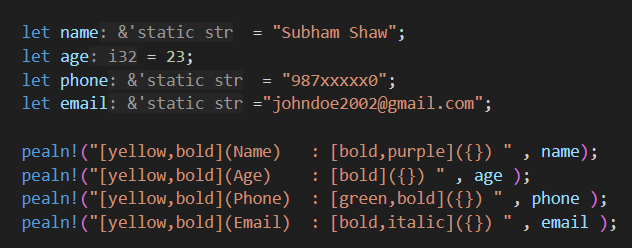
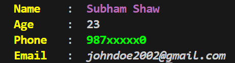

# Pealn

<p align="center">
  
</p>

<p align="center">
  <a href="https://crates.io/crates/pealn">
    
  </a>
  <a href="https://crates.io/crates/pealn">
    
  </a>
  <a href="https://crates.io/crates/pealn">
    
  </a>
</p>


**Pealn** is a Rust library for **printing coloured text** to make your CLI app  beautiful as a Peacock


<p align="center">
  
</p>

<p align="center">
  
</p>

## Features
- **Compile time** format pealn codes during compile time i,e \[red](name) converted to \x1b\[38;2;255;0;0m name \x1b[0m during compile time
- **Easy to use** Apply modification inside string
- **Pre defined Colors** Common colors  are already defined
- **Text Styles** Add Styles like , bold , italic , underline and more
- **Use RGB colors** Apply colors using RGB value


## Pealn is an Alternative

| Traditional Rust Macro | Pealn Macro Alternative |
|------------------------|------------------------|
| `print!()`             | `pea!()`               |
| `println!()`           | `pealn!()`             |

## Installation

Add Pealn to your Cargo.toml:

```toml
[dependencies]
pealn = "0.3"
```

Add Pealn using Cargo CLI:
```
cargo add Pealn
```

print new line  with colored and styles
## Format

```rust
[foreground,background,styles....](text) 
```

## 🎨 Available Colors

| Name      | Preview                          | Example Code         |
|-----------|----------------------------------|----------------------|
| Red       | <span style="color:#ff0000;">■</span> | `[red](text)`        |
| Green     | <span style="color:#00ff00;">■</span> | `[green](text)`      |
| Blue      | <span style="color:#0000ff;">■</span> | `[blue](text)`       |
| Yellow    | <span style="color:#ffff00;">■</span> | `[yellow](text)`     |
| Cyan      | <span style="color:#00ffff;">■</span> | `[cyan](text)`       |
| Purple    | <span style="color:#800080;">■</span> | `[purple](text)`     |
| Magenta   | <span style="color:#ff00ff;">■</span> | `[magenta](text)`    |
| Black     | <span style="color:#000000;">■</span> | `[black](text)`      |
| White     | <span style="color:#ffffff;">■</span> | `[white](text)`      |

> *Note: Color preview may not render*

---

## ✨ Available Styles

| Style          | Example Code         | Description                  |
|----------------|---------------------|------------------------------|
| Bold           | `[bold](text)`      | **Bold text**                |
| Dim            | `[dim](text)`       | Dim/faint text               |
| Italic         | `[italic](text)`    | *Italic text*                |
| Underline      | `[underline](text)` | <u>Underlined text</u>       |
| Blink          | `[blink](text)`     | Blinking text (not always supported) |
| Reverse        | `[reverse](text)`   | Reverse video                |
| Hidden         | `[hidden](text)`    | Hidden text                  |
| Strikethrough  | `[strikethrough](text)` | ~~Strikethrough~~           |

> *Some styles may not be supported in all terminals.*


### *Note:Some styles are not supported on every console , like blink,reverse and dim 
## Examples
 
 To print text with foreground
 ```rust
 use pealn::{pealn};
 pealn!("[yellow](Hello) [green](World)!");
 let name  = "Subham Shaw";
 pealn!("[yellow,bold](Name) : [bold,hidden]({}) " , name );
 ```

 you can use RGB color 

```rust
 use pealn::{pealn};
 pealn!("[(25,45,78)](Hello) [(34,67,78)](World)!");
 ```

 To print text with foreground and background
 ```rust
 use pealn::{pealn};
 pealn!("[yellow,white](Hello) [green,white](World)!");
 ```
 > **First color** defined is always considers as **foreground** and **second color** as **background** color, even if you put style in middle it will behave same 

 To print text with styles
 ```rust
 use pealn::{pealn};
 
 pealn!("[bold,underline](Hello) [italic](World)!");
 ```
 
 To print text with color and styles
 ```rust
 use pealn::{pealn};
 //here order of colors and styles does not matter, 
 //first color will be used as foreground and second as background
 pealn!("[red,green,bold,underline](Hello) [yellow,italic,white](World)!");
 ```
---

*Pealn makes your CLI apps more colorful and expressive!*
